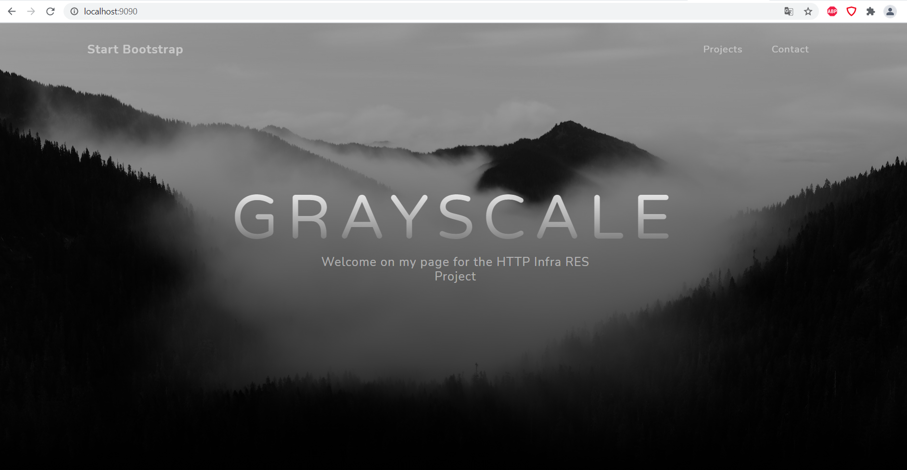

# Step 1 - Static HTTP Server

> Author : Blanc Jean-Luc
> Date : 30.05.2021

## Description

In this step, we will simply create and start a Docker container for Apache HTTPd so we can use a static website.

## Container

First to start we need to create a container for our Apache HTTPd server.
To do so we will use this dockerfile : 

```
FROM php:7.2-apache
COPY src/ /var/www/html/
```

Once we have finished creating our dockerfile, we need to enter those 2 commands so we can build and run our container : 

```
docker build -t res/apache_php .
docker run -p 9090:80 res/apache_php
```

## Template

Here is the template I used for this static website : 



## Config files in running container

Here is where the config files are located in a running container : 


Here we can see that the configurations files are in the /etc/apache2 path and that we can see some default configuration file in sites-available and sites-enabled.
