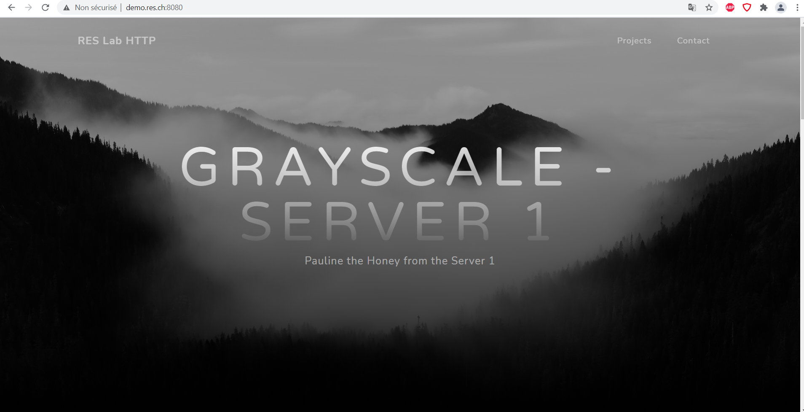
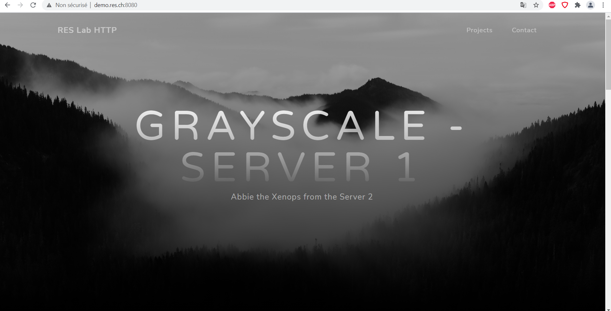
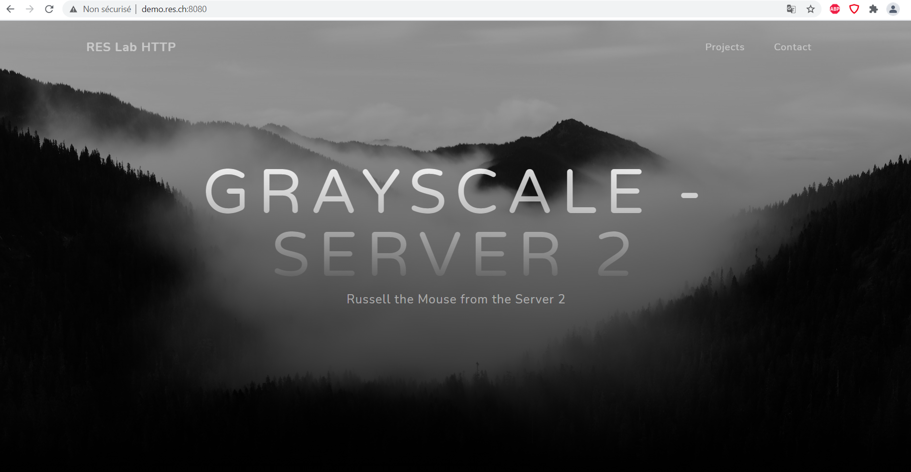
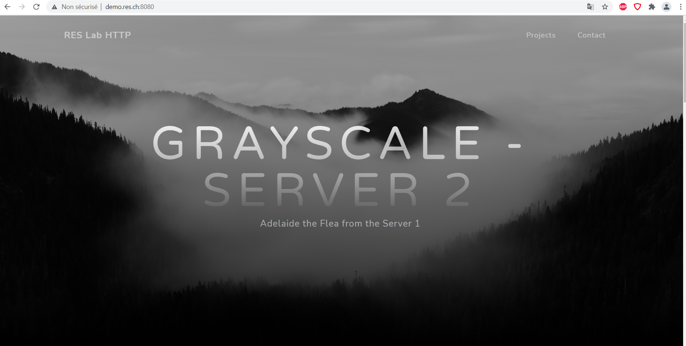

# Additional Steps - Load Balancing with multiple server nodes

> Author : Blanc Jean-Luc
> Date : 30.05.2021

## Description

In this step, we had to edit our proxy-server configuration in order for it to manage load balancing between multiple static and dynamic servers

## Container

First to start we need to create a container for our apache reverse proxy server.
To do so we will use this dockerfile : 

```
FROM php:7.2-apache

COPY apache2-foreground /usr/local/bin/
COPY conf/ /etc/apache2
COPY templates /var/apache2/templates

RUN apt-get update && apt-get install -y vim
RUN a2enmod proxy proxy_http proxy_balancer lbmethod_byrequests
RUN a2ensite 000-* 001-*
```

Once we have finished creating our dockerfile, we need to enter those commands so we can build and run our infra : 

In the apache-php-image folder
```
docker build -t lb-s1 .
docker run -d lb-s1
```
In the apache-php-image2 folder
```
docker build -t lb-s2 .
docker run -d lb-s2
```
In the express-image folder
```
docker build -t lb-d1 .
docker run -d lb-d1
```
In the express-image2 folder
```
docker build -t lb-d2 .
docker run -d lb-d2
```
In the apache-reverse-proxy folder
```
docker build -t lb-reverseproxy .
docker run -p 8080:80 -e STATIC_APP_1=172.17.0.2:80 -e STATIC_APP_2=172.17.0.3:80 -e DYNAMIC_APP_1=172.17.0.4:3000 -e DYNAMIC_APP_2=172.17.0.5:3000 lb-reverseproxy
```

Here we add 4 environment variables containing the 4 ip addresses of the 2 static servers and the 2 dynamic servers.

## Config-template

Here is the content of the config-template.php file used in order to manage load balancing : 

```
<?php
	$dynamic_app_1 = getenv('DYNAMIC_APP_1');
	$static_app_1 = getenv('STATIC_APP_1');
	$dynamic_app_2 = getenv('DYNAMIC_APP_2');
	$static_app_2 = getenv('STATIC_APP_2');
?>

<VirtualHost *:80>
	ServerName demo.res.ch
	
	<Proxy balancer://dynamic-app>
		BalancerMember 'http://<?php print "$dynamic_app_1"?>'
		BalancerMember 'http://<?php print "$dynamic_app_2"?>'
	</Proxy>
	
	<Proxy balancer://static-app>
		BalancerMember 'http://<?php print "$static_app_1"?>'
		BalancerMember 'http://<?php print "$static_app_2"?>'
	</Proxy>
	
	ProxyPass '/api/animals/' 'balancer://dynamic-app/'
	ProxyPassReverse '/api/animals/' 'balancer://dynamic-app/'
	
	ProxyPass '/' 'balancer://static-app/'
	ProxyPassReverse '/' 'balancer://static-app/'
</VirtualHost>
```

Here is the proof that this script works : 

website console proof picture

## Apache2-foreground

Here are the new lines in the Apache2-foreground file : 

```
# Add setup for RES lab
echo "Setup for the RES lab..."
echo "Static app 1 URL: $STATIC_APP_1"
echo "Dynamic app 1 URL: $DYNAMIC_APP_1"

echo "Static app 2 URL: $STATIC_APP_2"
echo "Dynamic app 2 URL: $DYNAMIC_APP_2"
php /var/apache2/templates/config-template.php > /etc/apache2/sites-available/001-reverse-proxy.conf
```


## Modifications in the static and dynamic servers

In order to witness which server is delivering the requests and responses we modified a few small things in the index.html file in the static servers and in the index.js file in the dynamic servers.

Exemple : 

Here we got our page from the Static 1 and the Dynamic 1 servers



Here we got our page from the Static 1 and the Dynamic 2 servers



Here we got our page from the Static 2 and the Dynamic 2 servers



Here we got our page from the Static 2 and the Dynamic 1 servers




The static server is attributed when we load the page, if we reload the same page again we might get a different server.

The dynamic server is attributed every time a request is sent to get the animal from the dynamic server, so every 5 seconds we might get a different server.
